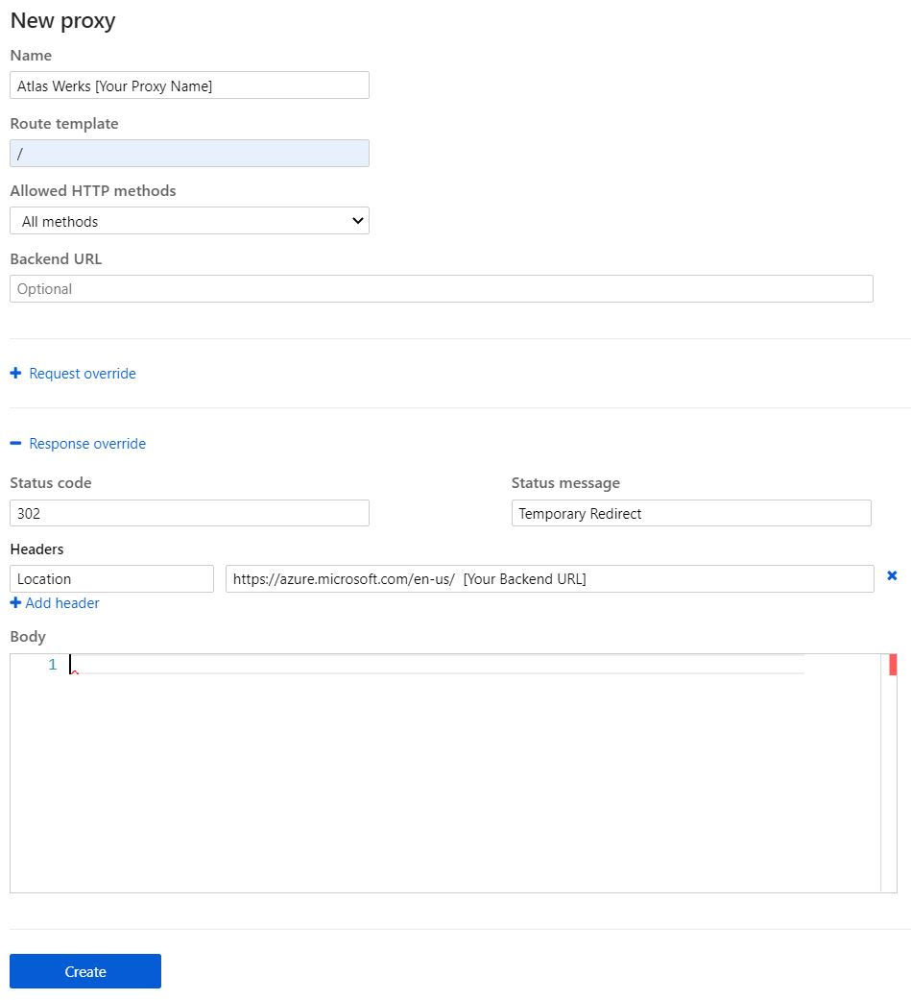

## Table Of Contents
- [Backgrond](#background)
- [Implementation](#implementation)
- [Results](#results)

---

## Background

Recently I was tasked with finding a cloud native solution that would allow incoming URL requests to be redirected to another URL destination. The cloud native solution had to be cost effective, require minimal configuration, and handle hundreds of request per day.

Enter **Azure Functions**.

Azure Functions are defined by Microsoft as the following:

*"Azure Functions is a cloud service available on-demand that provides all the continually-updated infrastructure and resources needed to run your applications. You focus on the pieces of code that matter most to you, and Functions handles the rest"*

Simply put, Azure Functions allow us to write code without worrying about the underlying hardware on which the code runs on. However, we wont be writing any code, so dont worry! This will be a simple click setup configuration!

---

## Implementation

To begin, deploy an Function App from the Azure portal using .Net core.

Make sure to set the pricing tier to *Consumption*.

Once deployed, navigate to the Function App and select the *Proxies* blade.

Create a new proxy configuration with the following settings (make sure to update your backend url):

Hit **Save**, and take note of the generated URL. You can use this URL to test the redirection of your backend url.

Testing with URL producings the expected results.

Function App Proxy URL is Redirected to:

Now we must updated our DNS provider with a CNAME recording pointing to the Function App Proxy URL.

---
## Results

